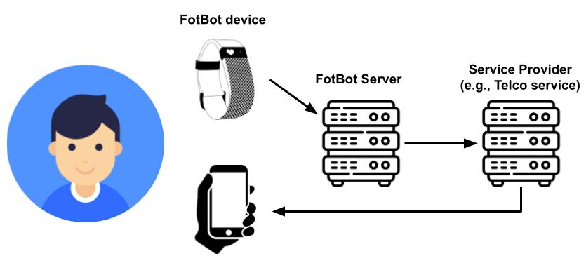
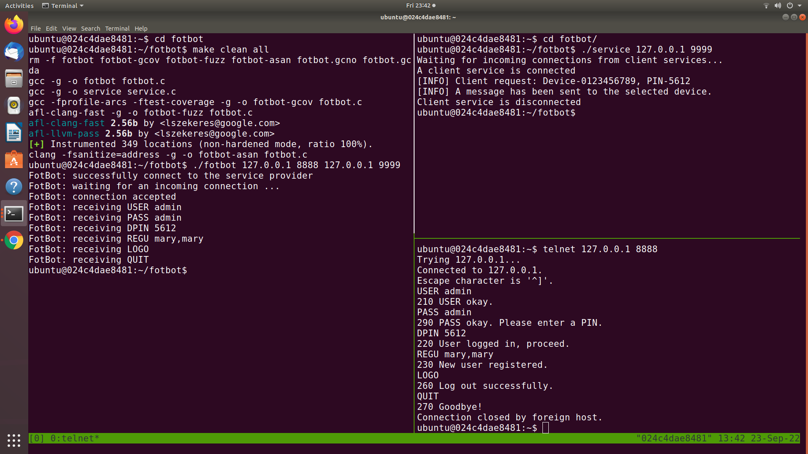
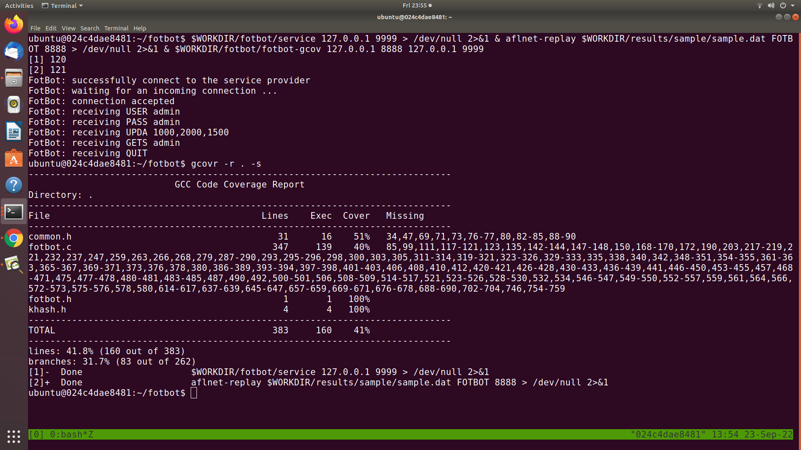

# SWEN90006 Assignment 2: Fuzzing FotBot Server with Multi-Factor Authentication (MFA) support

## Overview

This assignment deals with security testing using the code coverage-guided grey-box fuzzing technique (covered by Chapter 9 in the lecture notes). Since FotBot server is a stateful system (i.e., its behaviour depends not only on the current request message, which is sent from a client, but also on its current state controlled by previous sequence of messages), in this assignment you are recommended to use [AFLNet - A Greybox Fuzzer for Network Protocols](https://github.com/aflnet/aflnet) instead of the [vanilla AFL fuzzer](https://github.com/google/AFL). You are expected to read [AFLNet ICST'20 paper](https://thuanpv.github.io/publications/AFLNet_ICST20.pdf), watch [this presentation video](https://www.youtube.com/watch?v=Au3eO7mEI7E&t=2s), and read [AFLNet README document](https://github.com/aflnet/aflnet/blob/master/README.md) to understand the key concepts of stateful fuzzing for network protocol implementations before starting this assignment.

In this assignment, the FotBot server is implemented in C and it supports a simple multi-factor authentication (MFA) mechanism similar to what explained in the Assignment 1. More details are provided in "The System: FotBot" section. 

The aim of this assignment is to systematically fuzz test the FotBot server to discover security vulnerabilities. Note that in the context of this assignment, we only consider the following types of faults as security vulnerabilities.

1. Any fault that causes FotBot to crash or hang leading to a denial-of-service attack (e.g., Null pointer dereference ([CWE-476](https://cwe.mitre.org/data/definitions/476.html))).
2. Critical memory faults such as Stack/Heap Buffer Overflow ([CWE-121](https://cwe.mitre.org/data/definitions/121.html) and [CWE-122](https://cwe.mitre.org/data/definitions/122.html)) and Use-After-Free ([CWE-416](https://cwe.mitre.org/data/definitions/416.html)).
3. Logic/functional faults that would allow attackers to gain unauthorized access (e.g., [CWE-285](https://cwe.mitre.org/data/definitions/285.html))
4. Logic/functional faults that would allow attackers to steal users' information or compromise the integrity of users' data.

It means that memory leaks and "benign" integer overflows (i.e., integer overflows that do not lead to more critical issues such as program crashes) are not counted.

## The System: FotBot

<p align="center">
  
</p>

FotBot looks like a wristwatch and includes functions for counting the steps of the wearer. This data is uploaded into a cloud-based system (i.e., FotBot server). In this assignment, we focus on testing this server. It has five main intended features:

1. To maintain a list of user accounts including an administrator account (username: "admin", password: "admin", MFA device id: "0123456789"). For simplicity, all passwords are not encrypted. To increase the security of the system, the admin account also uses MFA. Only the admin account should has the capability to add new users to the system.
2. To allow users update their password and add/replace their device id (i.e. a valid 10-digit mobile phone number) to enable MFA.
3. To record the number of steps a person takes each day.
4. To share information with other FotBot users for social reasons; e.g.competitions to see who can take the most steps.
5. To share information with the FotBot company. 

Detailed description of the functions for FotBot server and its implementation can be found in the file `fotbot/fotbot.c`. When the server is started, it first tries to connect to a simulated telecommunication company service (i.e., telco service as implemented in the file `fotbot/service.c`). Through this service, FotBot server implements the MFA mechanism. That is, the FotBot server uses the telco service to send PINs to registered user devices. Once the FotBot server-telco service connection is established, FotBot server starts another network channel and waits for connection requests from FotBot devices. A user can use their FotBot device/client to send requests/commands with arguments/parameters to login to the server, change password, add/replace their phone number (i.e., the device id in this implementation), update data, and retrieve their own or their friends' data. Specifically, FotBot server supports 12 commands: USER & PASS (for weak authentication) & DPIN (for stronger authentication with MFA), REGU (register a new user), AMFA (add/replace a device to enable MFA), UPDA (update step data), UPDP (update user password), GETS (get step data), ADDF (add a friend), GETF (get all friends), LOGO (logout of the current account), and QUIT (terminate a connection). For simplicity, FotBot server does not support concurrent FotBot server-FotBot device connections and once a connection is terminated (e.g., by the QUIT command), the FotBot server is stopped too. However, in one connection, users can log in and out with different user accounts.

### Building and running the program

The assignment comes with a Dockerfile to ease your setup. To build a "ready-to-fuzz" Docker image, you just need to run the "docker build" command. Specifically, the following command will build a Docker image named "swen90006-assignment2".

```bash
docker build . -t swen90006-assignment2
```

Once the Docker image is successfully built, you can start a Docker container (i.e., a virtual machine). If the container is started properly, you will see a prompt like "ubuntu@024c4dae8481" where "ubuntu" is the default username (its password is also "ubuntu") and "024c4dae8481" is the identifier of the running Docker container. You can start multiple containers from the same Docker image if you wish e.g. in case you want to run experiments with different settings. You can view all running Docker containers by running the "docker ps" command.

```bash
docker run -it swen90006-assignment2
```

The source code of the FotBot server is stored inside the `/home/ubuntu/fotbot` folder in the Docker container. To compile it and the telco service (service.c), you just need to run the following commands.

```bash
cd $WORKDIR/fotbot
make all
```

The "make all" command compiles FotBot & telco service and produces four different binaries: 1) the telco service (named service), 2) a normal fotbot server binary (named fotbot), 3) an instrumented binary for fuzzing with AFLNet (named fotbot-fuzz), 4) a binary to collect code coverage using [gcovr](https://gcovr.com/en/stable/guide.html) (named fotbot-gcov), 5) a binary built with [Address Sanitizer](https://releases.llvm.org/6.0.1/tools/clang/docs/AddressSanitizer.html) (named fotbot-asan) that helps you capture some non-crashing errors (e.g., Heap Buffer Overflow, Use-After-Free).

If you make changes to fotbot.c (e.g., adding assertions), you can delete existing binaries and recompile the program by running the following command.

```bash
cd $WORKDIR/fotbot
make clean all
```

The following screenshot shows a sample execution of the normal FotBot server (binary name: fotbot). Note that we use [tmux](https://github.com/tmux/tmux/wiki) to divide the screen into three parts called panes to show how the three components communicate with each other. On the left pane, you see FotBot server is running on the localhost (IP address: 127.0.0.1) and it is listening to the port 8888. Before that, it first connected to the telco service, which runs on the localhost as well on the port 9999 (top-right pane). On the bottom-right pane, you see a client---we use [telnet](https://www.acronis.com/en-sg/articles/telnet/) in this exampe---is connecting to and communicating with the server. Once the connection is established, the user can start sending requests/commands to the server. After each successful request, the client would receive a response from the server. For instance, after sending the "USER admin" request, since the username exists, the client receives "210 USER Okay.\r\n" where 210 is a response code. Note that "\r\n" are CR and LF characters in the [ASCII table](https://www.asciitable.com/) and these are control characters that can be used to mark a line break. All server responses follow the same structure---they start with a response code, followed by a space character and some descriptive message, and ends with CR and LF characters. In this example, the client, having the administrator role, sends a few more requests such as PASS, DPIN, and REGU to enter password, provide the PIN, and create a new user account, before logging out and terminate the connection. In real world scenarios, the telco service should send PINs to physical devices. However, in this simplified version, the service outputs the PINs directly to the screen to simulate the process.



## Your tasks

In this assignment, you are expected to complete the following tasks.

### Task-0: Complete group_info.txt and GroupAgreement.docx

Modify the file group_info.txt by placing your group number followed by group members' names and student IDs. The group number should be the same as the [group number for assignment 2 in the LMS](https://canvas.lms.unimelb.edu.au/courses/131276/groups#tab-18670) and student ID is the student ID number (not username). This is so we can match your repository with your group for marking.

Moreover, you will need to discuss with other members in your group and complete a group agreement document following the given template (GroupAgreement.docx). 

The files must be updated and pushed to the repository by Thursday Oct 6th 2022. After that time, you should not make any changes to those files.

### Task-1: Prepare a fuzzing setup to fuzz FotBot server

Follow the instructions in AFLNet repository to prepare a fuzzing setup to fuzz FotBot server. Note that the AFLNet source code given in this repository already supports FOTBOT protocol (together with existing protocols like FTP, SMTP etc) so you do not need to make any changes to the files (e.g., `aflnet/aflnet.h` and `aflnet/aflnet.c`). However, You are free to make any changes to AFLNet (e.g., its mutation operators) if you think these could improve fuzzing performance.

### Task-2: Achieve high code coverage

Run and continuously improve the fuzzing setup to achieve high code coverage. For instance, you might want to improve the quality of the seed corpus or add a fuzzing dictionary. 

To measure how much code coverage your experiments have achieved, given a set of test inputs generated in your experiments, you should run those inputs with the fotbot-gcov binary so that the code coverage information can be collected (see https://gcovr.com/en/stable/guide.html). In the follwing screenshot, we show a sample command to collect the code coverage achieved by a single test input.

```bash
$WORKDIR/fotbot/service 127.0.0.1 9999 > /dev/null 2>&1 & aflnet-replay $WORKDIR/results/sample/sample.dat FOTBOT 8888 > /dev/null 2>&1 & $WORKDIR/fotbot/fotbot-gcov 127.0.0.1 8888 127.0.0.1 9999
```

The command has three parts: 1) the simulated telco service runs on localhost at port 9999, 2) aflnet-replay, which is a utility of AFLNet, plays the role of a client application and 3) the fotbot server runs on localhost as well at port 8888. aflnet-replay connects to the FotBot server and sends a sequence of requests to the server. While the server is executing and handling the requests, all executed lines and branches/edges in the server source code are recorded in a file named `fotbot.gcda`. In this command, all output from the aflnet-replay utility is discarded because it is redirected to `/dev/null`, which is a special file that is present in every Linux/Unix-based system.

Once the above command completes, you can run `gcovr -r . -s` to get the code coverage information. In this example, it shows a summary of the line coverage and branch coverage:  41.8% of lines and and 31.7% of branches have been covered respectively. Gcovr can also generate a detailed coverage report in HTML format for further analysis. Please read this [gcovr tutorial](https://gcovr.com/en/stable/guide.html) for more instructions.



### Task-3: Discover vulnerabilities

The given FotBot server has at least three (3) known security vulnerabilities. You are expected to discover all of them and write detailed explanations about what the vulnerabilities are, their impacts and how to reproduce them. Since this assignment focuses on fuzzing, you should document all the instructions to find those vulnerabilites through fuzzing. The markers may follow the instructions to confirm your findings.

### Task-4: Write report & reflections

Write a report documenting all your steps from your initial fuzzing setup to improvements you have made to achieve high code coverage & discover more vulnerabilities. Moreover, you are expected share reflections on your experiments about what works well and what does not work. You can also share your opinions about the advantages and limitations of the selected fuzzer (AFLNet) and suggest changes for improvements.

We do not provide any templates for the report & reflections but you are expected to write a well-structured document to clearly and logically demonstrate your understanding of the topics.

### Task-5: Submit experimental artefacts

Submit all the artefacts to the `results` folder by following the instructions written in `results/README.md`.

## Marking criteria

The assignment is worth 25% of your final mark.

| Criterion  | Description  | Marks  |
|---|---|---|
| Workable fuzzing setup | Clear instructions for markers to successfully rerun your fuzzing experiments if necessary.  | 5 |
| Code coverage achieved | Adequate code coverage, including both line coverage and branch coverage, as reported by [gcovr](https://gcovr.com/en/stable/guide.html). You will get zero marks for this part if your achieved line coverage and branch coverage are less than 75% and 55%, respectively. | 5 |
| Vulnerabilitis discovered | You are expected to discover three vulnerabilites to get full marks for this criteria. Your three vulnerabilities might or might not be the same as the three intentionally created ones. You could get bonus marks (1.5 marks for each vulnerability) if you find more than three vulnerabilities. However, the total mark for this assignment cannot exceed 25. | 9 |
| Final report & reflections | Clear demonstration of understanding of the topics used in the assignment, presented in a logical manner.  | 6 |
| **Total** | | 25 |

## Submission instructions

Some important instructions:

1. Do NOT change the main logic (e.g., control flow and data flow) of the FotBot server. You are allowed to add assertions to capture non-crashing failures though and make small changes to control the randomness introduced by the MFA implementation.
2. Do NOT change the directory structure.

### Report submission

Your submission has two parts: 1) this repository, and 2) a PDF final report. Please submit your PDF report using the link on the subject Canvas site. Go to the SWEN90006 Canvas site, select *Assignments* from the subject menu, and submit in *Assignment 2 report*.

## Tips

Some tips to managing the assignment:

1. Ensure that you understand the notes *before* diving into the assignment. Trying to learn concepts covered in Chapter 8 and Chapter 9 of the notes.

2. Ensure that you understand the weekly fuzzing examples included in this [security-testing repository](https://github.com/swen90006-2021/security-testing).

3. Ensure that you understand how AFLNet works before starting the assignment.

4. Note that fuzzing does not like non-deterministic behaviors of the system under test (e.g., the MFA authentication) :).
	
### Late submission policy

If you require an extension, please contact Thuan ([`thuan.pham@unimelb.edu.au`](thuan.pham@unimelb.edu.au)) to discuss. Having assessments due for other subjects is not a valid reason for an extensive.

By default, everyone is implicitly granted an extension of up to 7 days, but with a penalty of 10% (2.5 marks) per day that the assignment is submitted late. So, if you are falling behind, you may want to consider submitted 1-2 days late if you feel you can do enough to make up the 2.5-5 marks. 

If you submit late, email Thuan to let him know so he can pull the changes from the repository.

### Academic Misconduct

The University academic integrity policy (see [https://academicintegrity.unimelb.edu.au/](https://academicintegrity.unimelb.edu.au/) applies. Students are encouraged to discuss the assignment topic, but all submitted work must represent the individual's understanding of the topic. 

The subject staff take academic misconduct very seriously. In this subject in the past, we have successfully prosecuted several students that have breached the university policy. Often this results in receiving 0 marks for the assessment, and in some cases, has resulted in failure of the subject. 

### Originality Multiplier

For work that we find is similar to another submission or information found online, an originality multiplier will be applied to the work.  For example, if 20% of the assessment is deemed to have been taken from another source, the final mark will be multiplied by 0.8.
